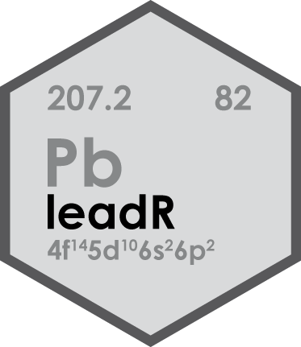
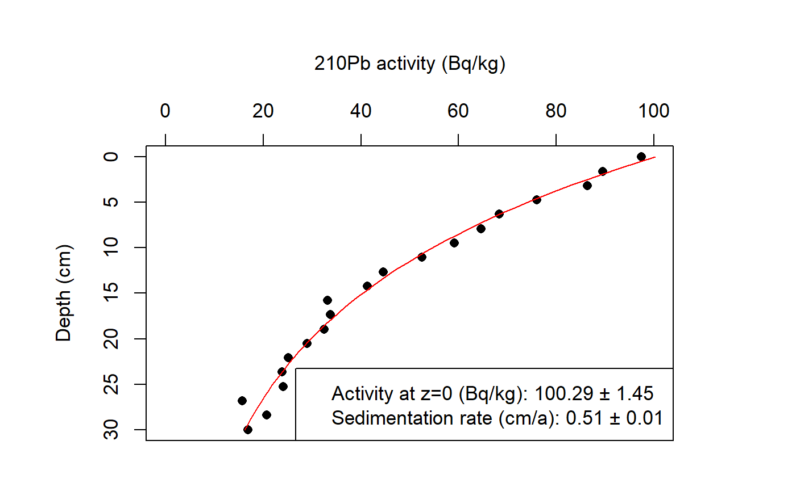

<!-- README.md is generated from README.Rmd. Please edit that file -->

# leadR <a href='https://tzerk.github.io/leadR/'></a>

<!-- badges: start -->

[](https://ci.appveyor.com/project/tzerk/leadr)
[](https://travis-ci.org/tzerk/leadR)
<!-- badges: end -->

> [Find a full documentation of the package on the project
> page](https://tzerk.github.io/leadR/)

## Overview

Sediment Deposition and Accumulation Rates Determined by 210Pb Isotope
Methods.

## Installation

The ‘leadR’ package is not available on the official CRAN servers.

However, the latest development builds can directly be installed from
GitHub. Simply run the following from an R console

``` r
if(!require("devtools"))
  install.packages("devtools")
devtools::install_github("tzerk/leadR")
```

## Features

Example of the ‘Constant Flux Constant Sedimentation Rate’ (CF:CS) model
ouput:

``` r
# Load example data (synthetic)
data(Pb)
str(Pb)
#> 'data.frame':    20 obs. of  2 variables:
#>  $ depth   : num  0 1.58 3.16 4.74 6.32 ...
#>  $ activity: num  97.5 89.6 86.5 76 68.3 ...

# Apply the model
results <- calc_SedimentationRate(x = Pb,
                                  reverse = TRUE,
                                  fix_a0 = FALSE,
                                  verbose = TRUE)
#> Equation: activity ~ 100.288 * exp((0.03114/0.512) * depth)
#> Sedimentation rate: 0.512 ± 0.013 cm/a
```

<!-- -->

## Note

This version is a development version and it comes without any
guarentee\!

## License

The leadR package is licensed under the MIT. See these files in the main
directory for additional details:

  - LICENSE - leadR package license (MIT)
